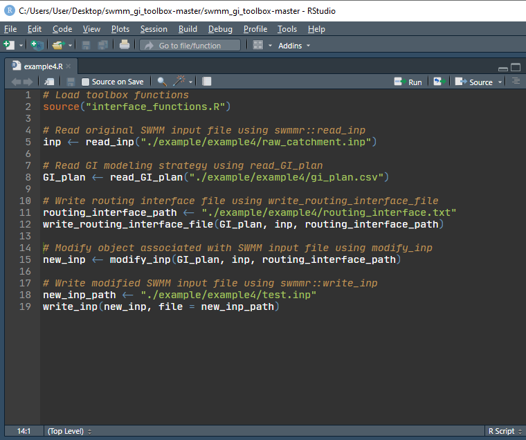

## Example 4 Minimal examples of using the code to couple green infrastructure (GI) models and SWMM

### 1. Set up R working environment

The toolbox works for Windows operating system, and is written in R. The first step is to set up an R working environment. The Rstudio IDE is recommended. The set up procedures can be found [here](https://www.earthdatascience.org/courses/earth-analytics/document-your-science/setup-r-rstudio/), [here](https://support.rstudio.com/hc/en-us/articles/201141096-Getting-Started-with-R), or using Google.

### 2. Download the toolbox

The toolbox can be downloaded at this [GitHub repository](https://github.com/stsfk/swmm_gi_toolbox). Click "Clone or download", then click "Download ZIP". 

Then unzip the file to a working folder, e.g., we can simply place the unpacked files on desktop.

### 3. Open the downloaded R project in Rstudio

Open Rstudio, then select "Open project", then click open *swmm_gi_toolbox.Rproj* file in the working folder. As shown in the Figure below.


### 4. Prepare SWMM input file and output hydrographs from green infrastructures

The *raw_catchment.inp* file is SWMM input file of the original catchment beforing installing GIs. It should be copy to the working folder or its subfolders. In this case, the file is placed at "*working_folder*"/example/example4. 


The outflow hydrographs from GIs are stored in *outflow_1.csv* and *outflow_2.csv*. There are two columns in these files, "datetime" and "flow". 


The datetime column is in format "yyyy-mm-dd hh:mm:ss" in Microsoft Excel.


The file looks like the following if opened in text editor.


The flow column is the outflow rate in CFS (cubic feet per second) or LPS (liters per second), etc., depending on the unit used in SWMM simulation.

### 5. Prepare the GI modeling strategy input file 

The file is named as *gi_plan.csv*, it contains the following columns, (1) inflow_path, (2)	outlet, (3)	subcatchment_name, (4)	per_area_rep, (5) imp_area_rep, (6)	width_adj, (7) SUBAREAS_N-Imperv. The first 6 columns are compulsory, and the last one is optional. The number of the optional columns is arbitrary, and the names are set according to the modeling strategy defined by the modeler. 


**Required columns**:

1. *inflow_path*: the path of the file that stores the outflow hydrograph from GI. The hydrograph will be used as input flows to SWMM. It can be either [absolute path of relative path](https://stackoverflow.com/questions/36834767/how-to-use-rstudio-relative-paths) .
2. *outlet*: the node or the subcatchment that receives the inflow. *0* means the same outlet as the subcatchment is used.
3. *subcatchment_name*: the name of the subcatchment, where GIs are installed.
4. *per_area_rep*: pervious area represented by the inflow hydrograph, i.e., the pervious area modeled externally.
5. *imp_area_rep*: impervious area represented by the inflow hydrograph, i.e., the impervious area modeled externally.
6. *width_adj*: the subcatchment width parameter after modeled GIs externally. *0* means no change to subcatchment width.

**Optional columns**:

* The name of the optional columns are in the format "section_variable". The “section” term corresponds to the name of the tab used in swmm input files, such as the INFILTRATION tab; the infiltration parameters are store under this tab. The “variable” term corresponds to the name of the variable, e.g., “MaxRate” corresponds to the maximum infiltration rate. Thus, the column can be named as “INFILTRATION_MaxRate”, and different values can be assigned to the column to reflect the changes to subcatchment parameters after installing the GI associated with the inflows specified in the inflow_path column. "0" means no change to the parameters after installing GIs. In this study, SUBAREAS_N-Imperv correspond to the Manning's roughness n parameter for the impervious area of the subcatchment.

The *gi_plan.csv* provided by this example can be used as a template for future studies.

### 6. Create routing interface file

Create an R script named "example4.R" (the file is also provided in the example folder).

Copy the following code to the editor and then run.

```{r message=FALSE}
# Load toolbox functions
source("interface_functions.R")

# Read original SWMM input file using swmmr::read_inp
inp <- read_inp("./example/example4/raw_catchment.inp")

# Read GI modeling strategy using read_GI_plan
GI_plan <- read_GI_plan("./example/example4/gi_plan.csv")

# Write routing interface file using write_routing_interface_file
routing_interface_path <- "./example/example4/routing_interface.txt"
write_routing_interface_file(GI_plan, inp, routing_interface_path)
```

It looks likes the following figure.



A routing interface file named *routing_interface.txt* is created, and is placed at *example4* folder (specified by the `routing_interface_path` variable). The routing interface file looks like:


### 7. Create modified SWMM file

The SWMM input file is first read into R by `swmmr::read_inp`, and then modified using the `modify_inp` function. The modified SWMM input file is created using `swmmr::write_inp`.

Copy the following code to the editor and run.

```{r message=FALSE}
# Modify object associated with SWMM input file using modify_inp
new_inp <- modify_inp(GI_plan, inp, routing_interface_path)

# Write modified SWMM input file using swmmr::write_inp
new_inp_path <- "./example/example4/test.inp"
write_inp(new_inp, file = new_inp_path)
```

Now the modified SWMM input file is created, named *test.inp* and placed in *example4* folder. The file path is specified by the `new_inp_path` variable.

The new input file opened in text editor looks like the following.


### 8. Run SWMM simulation

Now open the modified SWMM input file using SWMM and run simulation. The *USE INFLOW ... * text can be found in Options, Files tab.


Now click run simulation.

### 9. Check simulation results

Open Status Report, we can see that our catchment indeed received externally generated inflows.


The following figure shows the node J1 received higher flows than that generated by subcatchment S1, suggesting that J1 received exterally genereated runoffs.  The modeler can check the the catchment parameters or detailed simualation results to see if the toolbox worked as expected.


### 10. Summary

This example provides a minimal example of applying the proposed toolbox. The required files are, (1) SWMM input file of the catchment before installing GIs, (2) outflow hydrographs from GIs, (3) A modeling plan that specifies the changes to catchment parameters after installing GIs, (4) a few lines of code. Example files are provided in *exampl4* folder, and future modeler can use them as template and adapt them to new studies.


